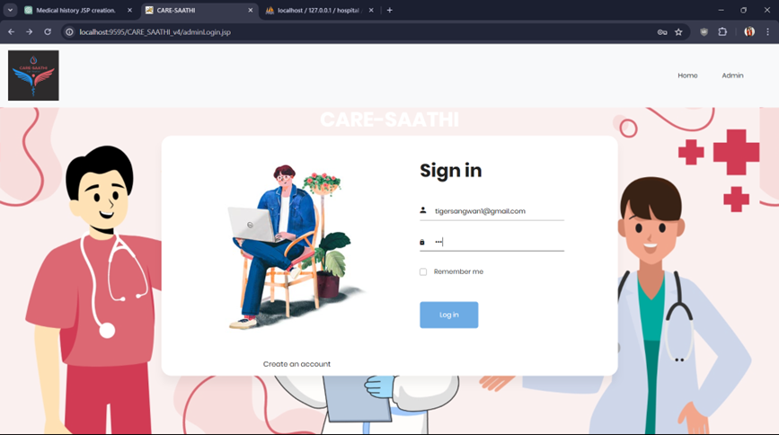

# CARE-SAATHI
CARE-SAATHI project in java using JSP, servlet, Mysql, and eclipse. Its using java as core technology and Mysql as backend to manage the data records. The application is following the MVC architecture with maven tool. HMS is a web application which is a help to manage the activity of an hospital Like Patient management, Doctor management, Manage appointments. Manage the records of patients.

The main objective to develop CARE-SAATHI in java is to manage the hospital activity online.

There will be four main Actors or Users of the application 
1. Doctor 
2. Admin 
3. Receptionist
4. Patient

There are four main actors of the system who going to manage or run the complete application. Let’s discuss one by one according to the role and readabilities.

# Modules

## Admin 
   Admin is the main actor who will be responsible for managing Doctors and Receptionists. Below is the task list which will be performed by admin.
 
  * Admin can ADD/DELETE/UPDATE a doctor.
  * Admin can VIEW the list of doctors.
  * Admin can ADD/DELETE/UPDATE a receptionist.
  * Admin can VIEW the list of receptionists.
  * Admin can ADD/DELETE/UPDATE a patient.
  * Admin can ADD/DELETE/UPDATE a appointments.
  
## Doctor:
  * Doctor can check the appointment and the patient list.
  * Doctor can VIEW the appointments. 
  * The doctor can VIEW the patient list.
   
   
## Receptionist:
  * Receptionist can ADD/EDIT/VIEW all appointments.
  * Receptionist can ADD/EDIT/VIEW all patient.
  * Process payment.

## Patient:
  * Receptionist can ADD/EDIT/VIEW appointments.
  * Receptionist can EDIT/VIEW patient.
   
 # Technology
   
Technology used in the CARE-SAATHI project in java

* Front-End: Jsp, Html, CSS, JS.
* Server-side: Java Servlet.
* Back-end: Java, PHP, MYSQL, XAMPP.
* Server: Tomcat 9.

Screenshot:

Admin Login:

Admin Dashboard:

